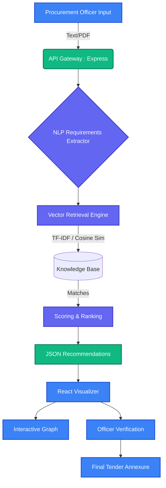

<div align="center">


**An Intelligent Information Retrieval System for Government e-Procurement**

[](https://reactjs.org/)
[](https://vitejs.dev/)
[](https://expressjs.com/)
[](https://www.typescriptlang.org/)
[](https://tailwindcss.com/)
[](https://vercel.com/)

</div>

---

## 🚀 Overview

The **AI Procurement Standards Assistant** is a specialized engine designed for **Smart India Hackathon 2026**. It solves a critical challenge in public procurement: ensuring that requested goods comply with the correct, up-to-date **Indian Standards (BIS)**.

Instead of manual standard lookup, procurement officers can input their raw tender requirements. The engine extracts the key technical properties, queries a specialized Information Retrieval (IR) vector space relying on TF-IDF & Cosine Similarity, and generates mapped standard recommendations embedded within an **interactive Knowledge Graph**.

## ✨ Key Features

- 🧠 **Smart Requirement Extraction:** Parses standard engineering terms, environments, and product names from raw text.
- 🕸️ **Interactive Knowledge Graph:** View dependencies between Primary matches and Normative references (Allied, Test, Safety standards).
- 🧑‍⚖️ **Human-in-the-Loop Validation:** Procurement Officers explicitly approve or reject standards before generation of the final annexure.
- 📊 **Automated IR Evaluation Suite:** Built-in quantitative benchmarking (Hit@1, Hit@3, MRR@5) to prove engine reliability.
- ⚡ **Offline-First Resilience:** Zero-dependency fallback to an embedded local vector simulation when external APIs are unavailable.
- 🚀 **Serverless Ready:** Configured for one-click global edge deployment via Vercel.

---

## 🏗️ System Architecture

Our solution uses a hybrid retrieval pipeline integrating deterministic rules (TF-IDF) with visually intuitive graphical interfaces.



---

## 🛠️ Setup & Local Installation

The project uses a clean monolithic structure where Vercel can run both the Vite frontend and Express server backend securely.

### Prerequisites
- Node.js `v18+`
- npm `v9+`

### Installation Steps

1. **Clone the repository**
   ```bash
   git clone https://github.com/your-org/SIH-2026.git
   cd SIH-2026
   ```

2. **Install Dependencies**
   ```bash
   npm install
   ```

3. **Environment Setup (Optional)**
   Copy the example `.env` file. *The application gracefully falls back to local simulation if these are missing, making development hassle-free!*
   ```bash
   cp .env.example .env
   ```

4. **Start Development Server**
   ```bash
   npm run dev
   ```
   *Your app is now running on `http://localhost:3000` (serving both Vite frontend and Express APIs!)*

---

## ☁️ Deployment to Vercel

We have rigorously configured this repository for **Serverless Deployment on Vercel**. The setup handles static frontend delivery and serverless Express execution seamlessly.

**One-Click Method:**
[](https://vercel.com/new)  
*(Push to your own GitHub, go to Vercel, and import the repo)*

**Manual Deployment via CLI:**
1. Install Vercel CLI: `npm i -g vercel`
2. Run `vercel` in the terminal root.
3. Accept the default configurations (Vercel automatically recognizes the `vercel.json` config).
4. For Production: `vercel --prod`

---

## 📈 Evaluation & Benchmarks

To ensure the AI engine does not hallucinate, we integrated an academic-style **Evaluation Suite**. 

By navigating to the `/api/evaluation/run` endpoint (or checking the Dashboard Metrics widget), the system runs standard benchmark queries against our known ground-truth dataset to calculate:
- **Hit@1:** Accuracy of the top-most prediction.
- **Hit@3:** Ensure correct BIS standard is within the top 3 cards.
- **MRR@5:** Mean Reciprocal Rank to grade weighting algorithms.

---

## 👥 The CrimsonCoders Team

- **Shreyash Banzal**
- **Saniya Gupta**
- **Aastha Agrawal**
- **Yashmanglam Soni**
- **Akshat Gupta**
- **Mitali Mehra**

---

<div align="center">
  <p>Built with ❤️ by <b>CrimsonCoders</b> for Smart India Hackathon 2026</p>
</div>
